# Munch Match (Delivery App)

An Android food discovery and ordering app built with Kotlin and Jetpack Compose. It features a login/registration flow backed by Firebase Auth + Firestore, a Room-powered local catalog with 1000+ generated food items, tabbed navigation (Home/Browse/Orders/Profile), a guided order flow (delivery/dine‑in), a basic chatbot, demo ML-style list and review screens, Google Maps with venue pins (Mumbai), multimedia capture (photo/video/audio) and GPS, connectivity sensing, and rich notifications.

---

## 📸 Application Screenshots  

### 🔥 Core Interface & AI Features
| AI Alerts & Notification | AI Chatbot | App Start Screen | Main Dashboard |
|---|---|---|---|
| 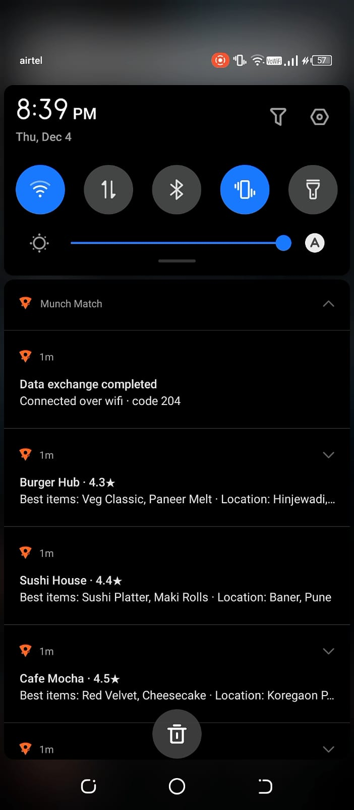 | 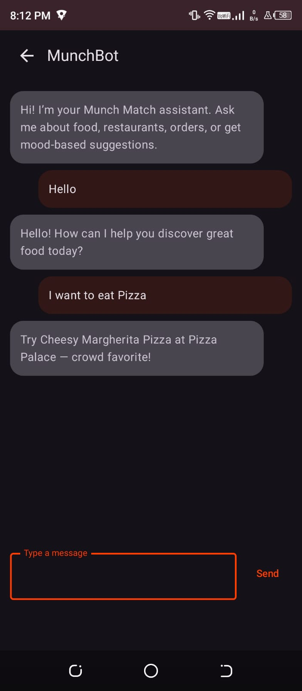 | 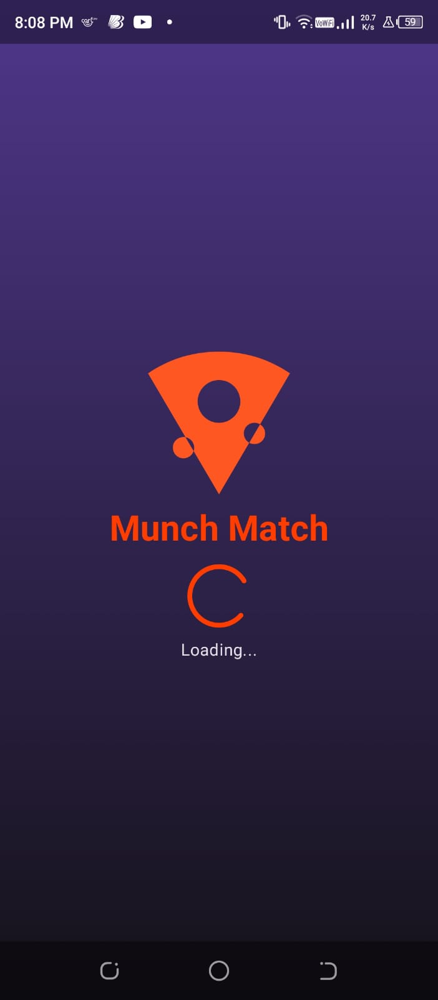 | 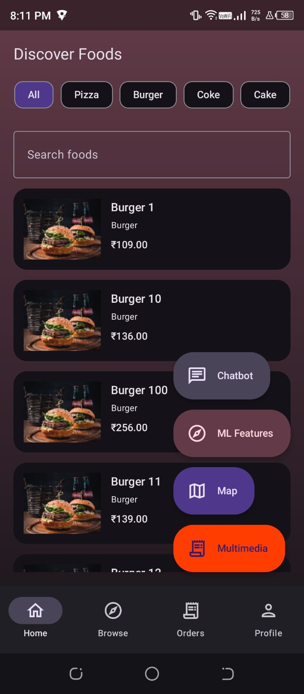 |

### 🍽 Food Menu & Ordering Screens
| Delivery Details | Burger Dish | Coke Drink Item | Pasta Dish |
|---|---|---|---|
| 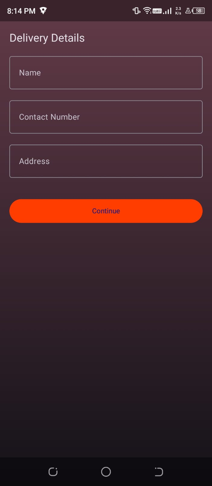 | 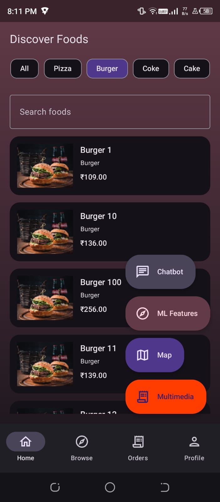 | 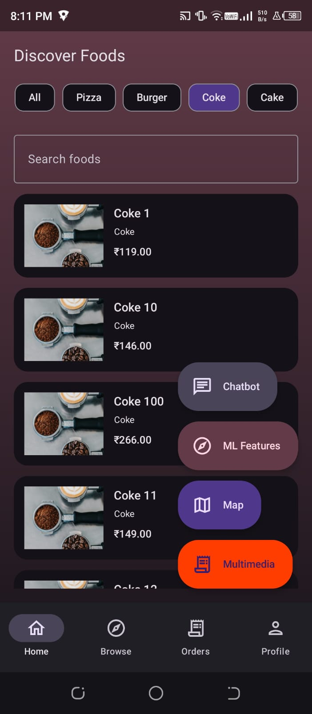 | 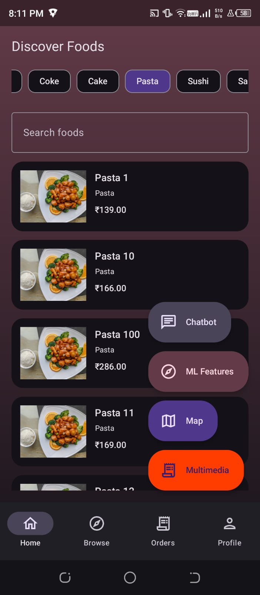 |

| Salad Plate | Sandwich Meal | Sushi Dish | Dine-In Restaurant List |
|---|---|---|---|
| 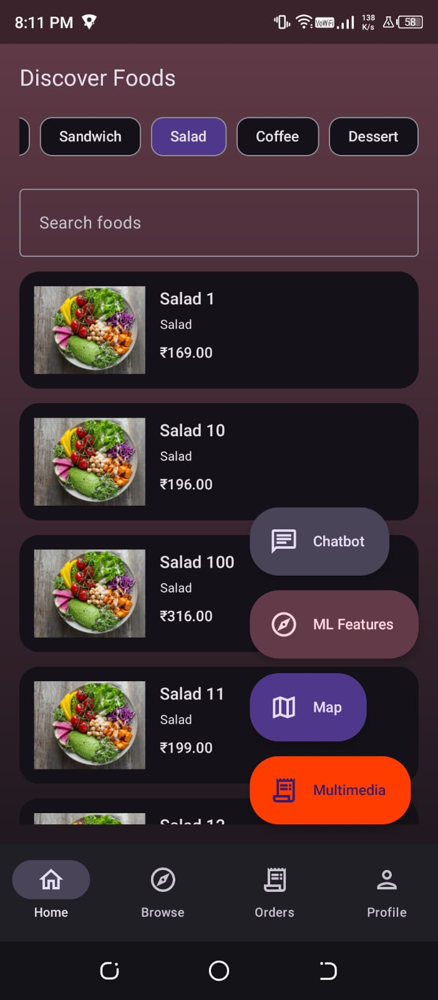 | 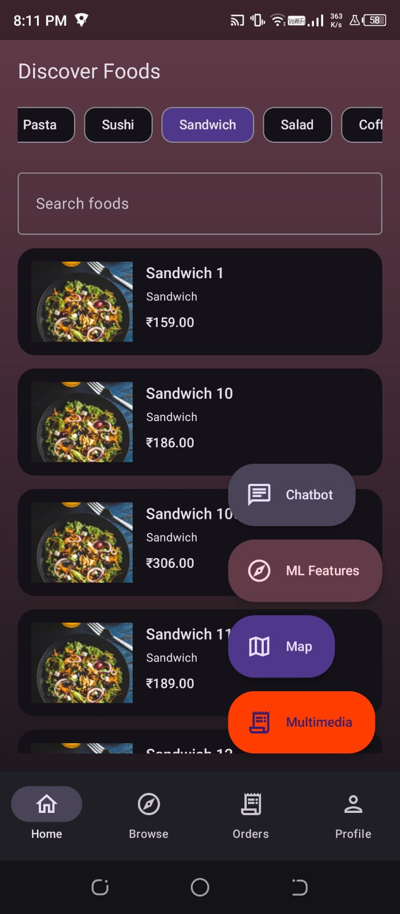 | 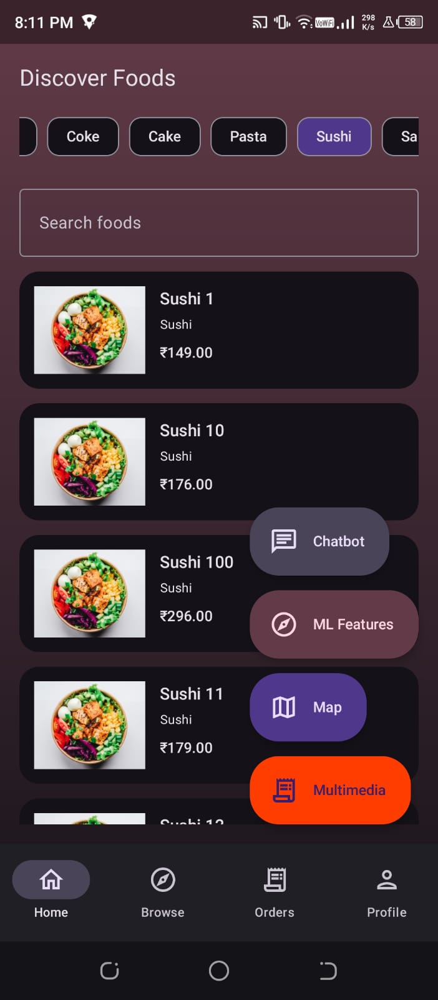 | 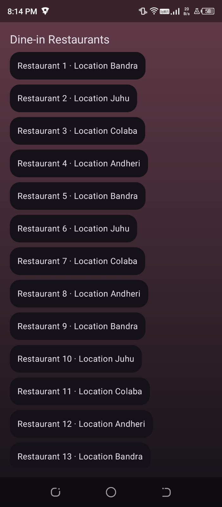 |

### 🔥 Cloud Backend & Firebase Modules
| Firebase Authentication | Firebase Cloud Messaging | Firebase Project Details | Firebase Users DB |
|---|---|---|---|
| 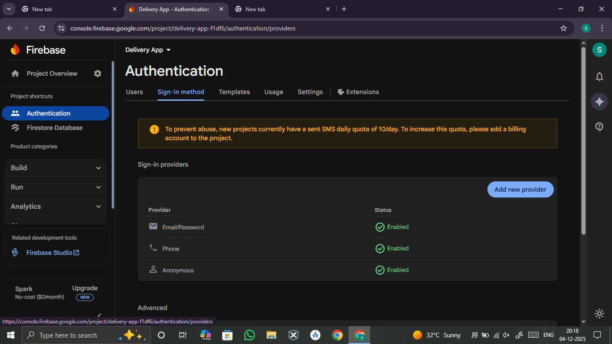 | 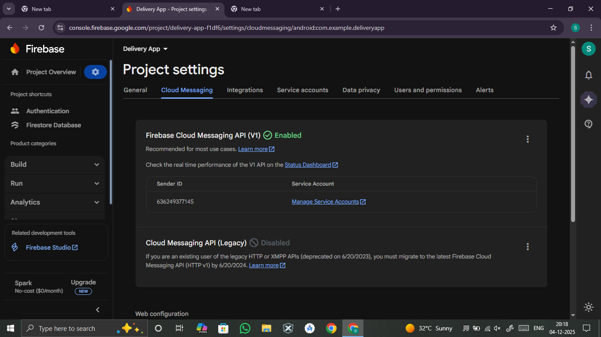 | 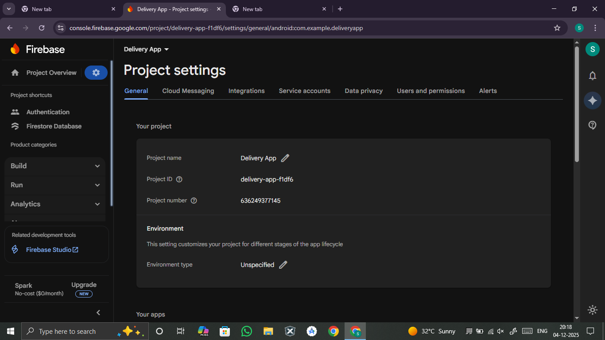 | 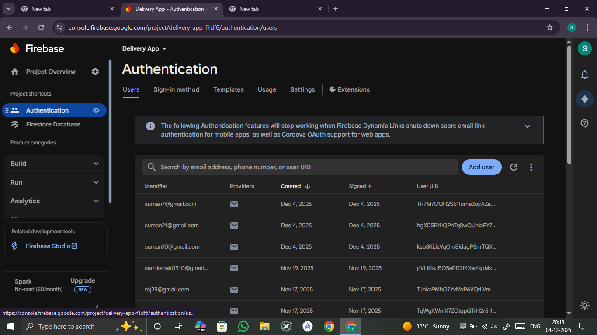 |

### 📍 Location, Payments & AI Recommendation
| Payment Summary (GPay) | Login Screen | Map Restaurant Locations | ML BERT Recommendation |
|---|---|---|---|
| 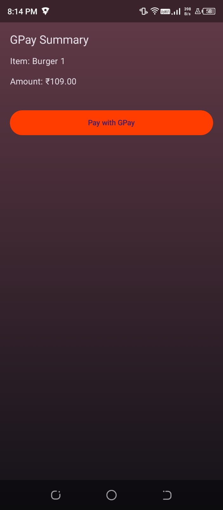 | 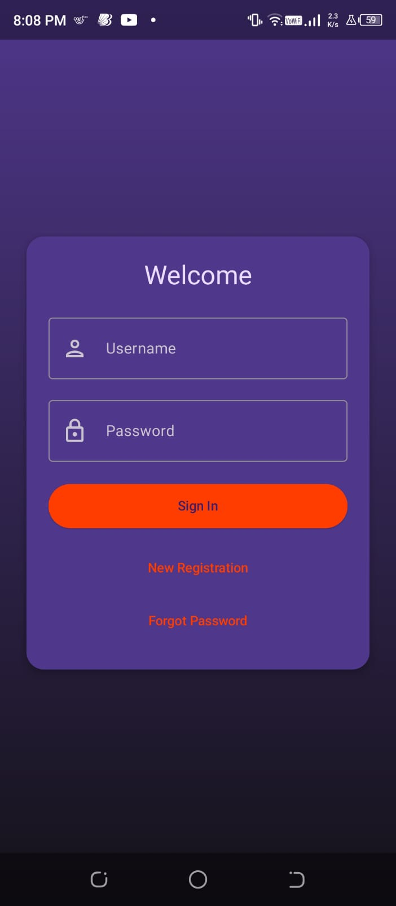 | 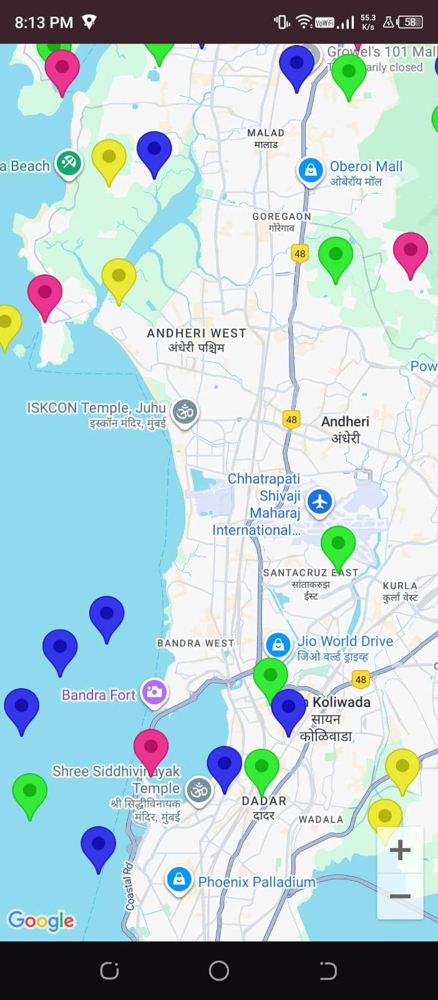 | 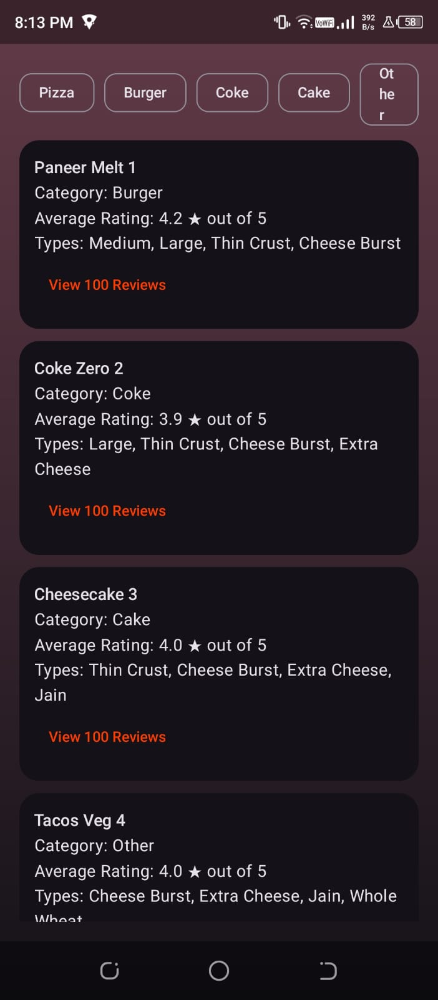 |

### 📦 Order & UI Workflow Screens
| Multimedia Upload | Order Confirmed | Order Method Selection | Order List |
|---|---|---|---|
|  |  |  |  |

### 👤 User & Review Panels
| Payment Method | Profile Screen | Registration | User Reviews |
|---|---|---|---|
|  |  | 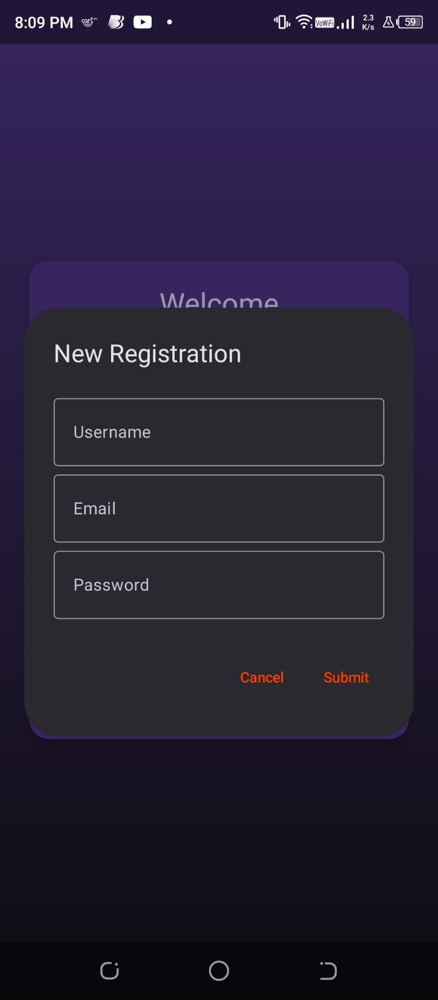 | 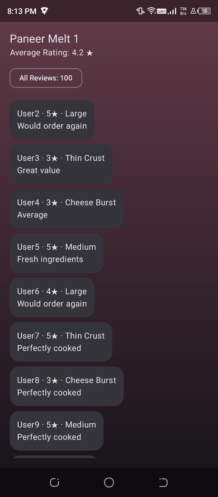 |


## At a Glance
- App name: Munch Match
- Package/namespace: `com.munchmatch.app`
- applicationId: `com.example.deliveryapp` (can be aligned with namespace if desired)
- Min/Target SDK: 24 / 34
- Kotlin/JVM: Kotlin 1.9.24, JVM target 17
- UI: Jetpack Compose + Material 3 + Navigation
- Data: Room (Food items), Firebase (Auth + Firestore)
- Maps: Google Maps SDK
- Media & Location: Camera, video, audio intents; GPS access
- Notifications: Android notifications with channel `munchmatch.alerts`

---


## Core Features
- Authentication (Login/Registration)
  - Username lookup in Firestore to email, then Firebase Auth email+password sign-in.
  - Registration dialog creates Auth user and persists profile in Firestore.
- Splash Screen
  - 3-second intro then navigates to Login.
- Main Tabs (Bottom Navigation)
  - Home: Category chips, search bar, and infinite-like list of Room-backed food items. Tapping an item starts the order flow.
  - Browse: Simple demo search across a static list of restaurants.
  - Orders: Demo current order status with progress; recent orders list.
  - Profile: Editable fields and live Order status view.
- Order Flow
  - Start: Choose Home Delivery vs. Dine In.
  - For Delivery: Enter details → select payment (COD/GPay) → confirmation/success.
  - For Dine-in: 100-item venue list.
- Chatbot
  - Local, keyword/fuzzy-matching knowledge base. No network/API required.
- ML-style Features
  - Synthetic dataset (100 items × 100 reviews) with categories, ratings, review lists, and detail screen.
- Maps (Mumbai)
  - Google Map centered on Mumbai with 100 venue markers (restaurants, cafes, hotels, pubs) using colored pins.
- Multimedia & GPS
  - Take Photo/Record Video/Record Audio using system intents and save to gallery.
  - Request GPS and show last known location.
- Connectivity + Data Exchange
  - Observes network transport type. On first connection, performs an HTTP probe and posts a notification about result and transport.
- Notifications
  - Posts sample alerts on app entry (after permission on API 33+), with a dedicated channel and custom icon.

---

## Architecture & Tech Stack
- Language: Kotlin
- UI: Jetpack Compose, Material 3, Navigation Compose
- State: ViewModel + StateFlow (e.g., `FoodViewModel`)
- Local Data: Room Database (`AppDatabase`) with seeding of 1000+ `FoodItem`s
- Cloud: Firebase Auth + Firestore (user registry, login)
- Networking: Minimal demo probe via `HttpURLConnection`
- Media/Location: Intents for camera/video/audio; `LocationManager` for GPS; MapView interop
- Other: Coil for image loading; notifications with `NotificationCompat`

---

## Dependencies (key)
- Compose BOM `2024.09.02`, Material3, Navigation Compose
- Lifecycle runtime/viewmodel, Coroutines
- Coil Compose `2.6.0`
- Accompanist System UI Controller `0.36.0`
- Google Play Services Maps `18.2.0`
- Firebase BOM `33.4.0` (Auth, Firestore)
- Room `2.6.1` (runtime, ktx, kapt compiler)

See `app/build.gradle.kts` for exact versions.

---

## Permissions
Declared in `AndroidManifest.xml`:
- `INTERNET`
- `ACCESS_NETWORK_STATE`
- `POST_NOTIFICATIONS`
- `ACCESS_FINE_LOCATION`
- `ACCESS_COARSE_LOCATION`
- `WRITE_EXTERNAL_STORAGE` (only for maxSdk 28; scoped storage is used on Q+)

Runtime permissions are requested where required (e.g., notifications on API 33+, fine location in Multimedia screen).

---

## Configuration Required

### 1) Google Maps API Key
- The manifest includes a `meta-data` entry for `com.google.android.geo.API_KEY`.
- Replace the existing value with your own Maps SDK key.
- Security: Do not commit real keys to VCS. Prefer using `local.properties` or a manifest placeholder via Gradle.

Example (safer) Gradle placeholder approach in `app/build.gradle.kts`:
```kotlin
android {
    defaultConfig {
        manifestPlaceholders["MAPS_API_KEY"] = project.findProperty("MAPS_API_KEY") as String? ?: "REPLACE_ME"
    }
}
```
Then in `AndroidManifest.xml`:
```xml
<meta-data android:name="com.google.android.geo.API_KEY" android:value="${MAPS_API_KEY}" />
```
And define `MAPS_API_KEY=your_key` in your `~/.gradle/gradle.properties` or project `gradle.properties` (avoid committing secrets).

### 2) Firebase Setup
- Create a Firebase project and enable **Authentication (Email/Password)** and **Cloud Firestore**.
- Download `google-services.json` and place it in `app/`.
- In Firestore, create a `users` collection where each document id is the username; store fields like `email`, `uid`, `createdAt`.
- The app expects to resolve `username → email` via Firestore before calling Firebase Auth.

### 3) Application ID (optional)
- Current `applicationId` is `com.example.deliveryapp` while the namespace is `com.munchmatch.app`.
- You can align these by changing `defaultConfig.applicationId` to `com.munchmatch.app` (and updating Firebase config accordingly), especially if you plan to publish or use App Links.

---

## Build & Run
1. Open the project in **Android Studio (Giraffe+ recommended)**.
2. Ensure you have **Android SDK 34** and **JDK 17** installed.
3. Add the required configuration:
   - Place `app/google-services.json` (Firebase).
   - Configure a valid **Google Maps API key** as described above.
4. Sync Gradle. Build the `app` module.
5. Run on a device/emulator (API 24+). Grant runtime permissions when prompted.

---

## Feature Walkthrough
- Launch: Splash → Login.
- Login: Use registered username + password. Registration flow stores user in Auth + Firestore.
- Main Tabs:
  - Home: Filter by category, search, tap item to start order flow.
  - Browse: Quick search among demo restaurants.
  - Orders: See current and recent orders.
  - Profile: Edit profile; shows live order status from `OrderStore`.
- FAB Shortcuts: Chatbot, ML Features (list/detail with 100 reviews), Map (Mumbai pins), Multimedia (photo/video/audio, GPS).
- Order Flow: Start → Delivery Details → Payment (COD/GPay) → Confirmation/Success. Dine-in → venue list.
- Notifications: Sample restaurant alerts posted at app entry; network probe result notification on first connectivity.

---

## Data Layer Details
- Room database `munchmatch.db` with table `food_items`:
  - Columns: `id` (PK, auto), `name`, `category`, `price`, `imageUrl`.
  - DAO query supports optional `category` and `name LIKE %query%` filters.
  - Prepopulated with 1000+ items across categories (Pizza, Burger, Coke, Cake, Pasta, Sushi, Sandwich, Salad, Coffee, Dessert) with Unsplash image URLs.

---

## Troubleshooting
- App builds but login fails: Ensure `google-services.json` is present and Firebase Auth/Firestore are enabled. Check Firestore rules and network.
- Username not found: Create the user via Registration (or ensure a document exists in `users/{username}` with `email`).
- Maps not showing: Confirm a valid Maps API key and that billing is enabled for the project.
- Notifications not appearing: On Android 13+, grant the Notifications permission when prompted.
- Camera/Video not saving: On older devices (pre-Q) ensure external storage permission model; on Q+, media is saved with scoped storage.
- Location shows Unknown: Enable device location and grant fine location permission.

---

## Notes & Future Improvements
- Align `applicationId` with `namespace` (`com.munchmatch.app`).
- Externalize secrets: move API keys to Gradle properties/CI secret store.
- Replace demo data (Room seed, ML reviews, Browse list) with real backend APIs.
- Add proper DI (e.g., Hilt) and repository abstractions for Firebase.
- Add UI tests and unit tests for ViewModels/DAO.
- Improve chatbot with real LLM or on-device ML.

